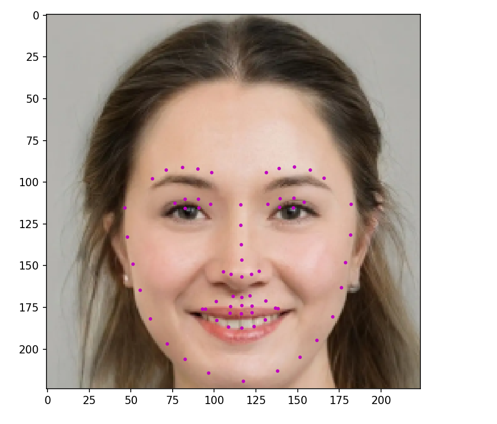

# 人脸关键点检测——Paddle实现


## 1. 环境配置

- paddlepaddle-gpu==2.3.0
- opencv-python==4.5.5.64
- tqdm==4.64.0
- numpy==1.19.3
- Pillow==9.1.0
- visualdl==2.2.3


## 2. 数据准备

链接：https://pan.baidu.com/s/14W6OIU3h3FVwSEoEmlx8xA 
提取码：bj9n 
或者登录：https://aistudio.baidu.com/aistudio/datasetdetail/69065

数据文件夹格式如下：
```python
- datasets            
	- training               # 训练集
		- xxx.jpg
		- xxx.jpg
		- xxx.jpg
		- ...
	- test                   # 测试集
		- xxx.jpg
		- xxx.jpg
		- xxx.jpg
		- ...
	- test_frames_keypoints.csv      # 测试集标签
	- training_frames_keypoints.csv  # 训练集标签
```

## 3. 训练步骤
在train.py文件中，参数设置如下：
```python
# ------------------------------------ #
# -----------参数设置------------------ # 
# batch_size -> 批次
# 主干网络 -> 'mobilenetv1', 'mobilenetv2', 'resnet50'
# epochs -> 轮次
# model_path训练权重，会自动下载预训练权重，可以不用设置
# input_shape -> 输入图片大小

batch_size = 16
backbone = 'mobilenetv2'
epochs = 100
model_path = ''
input_shape = [224,224]

```

训练结束后可以使用如下命令查看训练过程可视化的参数：
```txt
visualdl --logdir ./logs1 --port 8080
```

## 4. 预测步骤
1. 首先在facekeypoints.py文件中，指定好参数
2. 运行在predict.py即可，如img/face.png
效果如下：



## 5. 参考

[https://aistudio.baidu.com/aistudio/projectdetail/1487972](https://aistudio.baidu.com/aistudio/projectdetail/1487972)